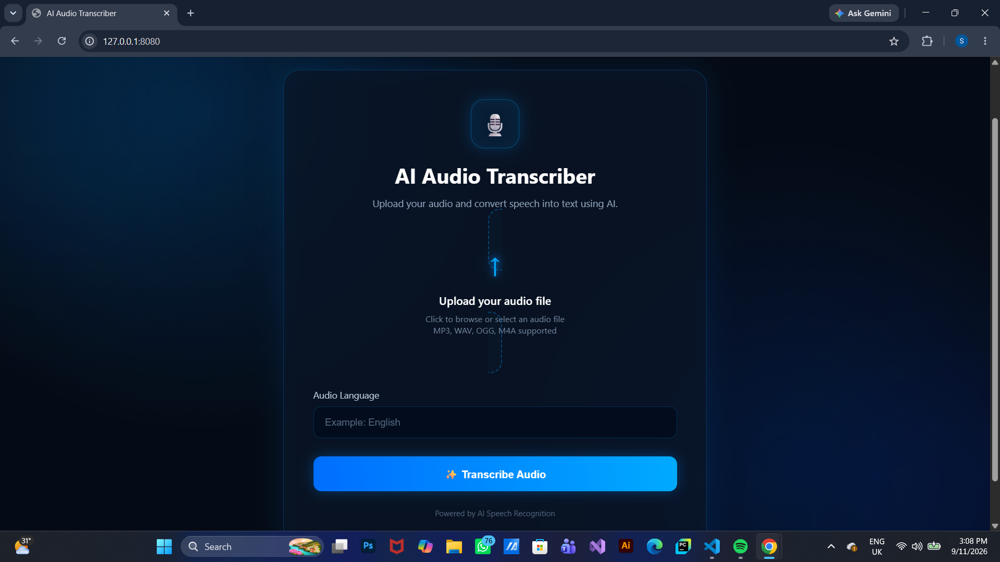

# 🎙️ Audio Transcript Translation — AI-Powered Speech & Translation

<p align="center">


</p>

<p align="center">
  <strong>
    An AI-powered web application that converts audio into text and translates the generated transcript using OpenAI GPT-4.
  </strong>
</p>

<p align="center">

🎙️ <strong>Audio Input</strong> → 📝 <strong>Transcript</strong> → 🌍 <strong>Translated Text</strong>

</p>

---

## 📌 Overview

The **Audio Transcript Translation Project** is an AI-powered web application designed to process audio files, generate a text transcript, and translate the resulting text into another language.

The project combines **Python**, **Flask**, and the **OpenAI API** to create a simple and practical AI application with a user-friendly web interface.

The main goal of this project is to demonstrate how modern AI APIs can be integrated into a real-world application for **speech-to-text processing, natural language processing, and translation**.

---

## ✨ Features

* 🎙️ Upload and process audio files
* 📝 Generate text transcripts from audio
* 🌍 Translate generated transcripts
* 🤖 Uses OpenAI GPT-4 for AI-powered language processing
* 🌐 Simple web-based user interface
* 🐍 Built with Python
* ⚡ Flask backend
* 🔐 Environment-variable based API key configuration
* 📄 Separate demo script for testing
* 🧩 Modular and easy-to-understand project structure

---

## 📸 User Interface

The application includes a simple web interface for interacting with the audio transcription and translation system.

<p align="center">
  
</p>


---

# 🏗️ System Architecture

```text
                    ┌─────────────────────┐
                    │      User           │
                    └──────────┬──────────┘
                               │
                               ▼
                    ┌─────────────────────┐
                    │   Flask Web UI      │
                    │   Audio Upload      │
                    └──────────┬──────────┘
                               │
                               ▼
                    ┌─────────────────────┐
                    │  Audio Processing   │
                    └──────────┬──────────┘
                               │
                               ▼
                    ┌─────────────────────┐
                    │ Speech-to-Text      │
                    │   Transcription     │
                    └──────────┬──────────┘
                               │
                               ▼
                    ┌─────────────────────┐
                    │   Text Transcript   │
                    └──────────┬──────────┘
                               │
                               ▼
                    ┌─────────────────────┐
                    │    OpenAI GPT-4     │
                    │     Translation     │
                    └──────────┬──────────┘
                               │
                               ▼
                    ┌─────────────────────┐
                    │ Translated Text     │
                    └─────────────────────┘
```

---

# 🔄 How It Works

The application follows a simple AI processing pipeline.

### 1️⃣ Audio Upload

The user uploads an audio file through the web interface.

### 2️⃣ Audio Processing

The application receives and processes the uploaded audio file.

### 3️⃣ Speech Transcription

The audio is converted into a text transcript.

### 4️⃣ Transcript Generation

The generated speech-to-text output is displayed as the original transcript.

### 5️⃣ AI Translation

The transcript is passed to **OpenAI GPT-4**, which translates the text according to the requested target language.

### 6️⃣ Display Results

The application displays the transcript and translated text through the web interface.

---

# 🧠 AI Pipeline

```text
Audio File
    │
    ▼
Audio Processing
    │
    ▼
Speech Recognition
    │
    ▼
Text Transcript
    │
    ▼
OpenAI GPT-4
    │
    ▼
Translation
    │
    ▼
Translated Text
```

---

# 🛠️ Technologies Used

| Technology             | Purpose                                      |
| ---------------------- | -------------------------------------------- |
| 🐍 Python              | Core programming language                    |
| 🌐 Flask               | Web application backend                      |
| 🤖 OpenAI API          | AI-powered language processing               |
| 🧠 GPT-4               | Translation and language understanding       |
| 🎙️ Speech Recognition | Audio-to-text processing                     |
| 🌍 Translation         | Converting transcripts into another language |
| 🔐 python-dotenv       | Environment variable management              |
| 🧰 Git                 | Version control                              |
| 🐙 GitHub              | Source code hosting                          |
| 🎨 HTML/CSS            | Web interface                                |

---

# 📁 Project Structure

```text
Audio-Transcript-Translation-Project/
│
├── app.py
├── demo.py
├── requirements.txt
├── .gitignore
├── README.md
│
├── docs/
│   └── ui.png
│
└── templates/
    └── index.html
```

---

# ⚙️ Installation

## 1️⃣ Clone the Repository

```bash
git clone https://github.com/sudeeraattanayake/Audio-Transcript-Translation-Project.git
```

Navigate into the project:

```bash
cd Audio-Transcript-Translation-Project
```

---

## 2️⃣ Create a Virtual Environment

Create a Python virtual environment:

```bash
python -m venv venv
```

### Windows

```bash
venv\Scripts\activate
```

### macOS / Linux

```bash
source venv/bin/activate
```

---

## 3️⃣ Install Dependencies

Install the required Python packages:

```bash
pip install -r requirements.txt
```

---

# 🔐 Environment Variables

The application requires an OpenAI API key.

Create a `.env` file in the project root:

```text
OPENAI_API_KEY=your_openai_api_key
```

### Example

```text
OPENAI_API_KEY=sk-xxxxxxxxxxxxxxxx
```

⚠️ **Never upload your API key to GitHub.**

Make sure `.env` is included in your `.gitignore` file.

Example:

```gitignore
.env
venv/
__pycache__/
.vscode/
*.pyc
```

---

# ▶️ Run the Application

After installing the dependencies and configuring the API key, run:

```bash
python app.py
```

The Flask application will start locally.

Open the local URL shown in your terminal in a web browser.

---

# 🎙️ Audio Transcription

The application allows users to provide an audio file and process it to generate a text transcript.

Example workflow:

```text
Audio File
     ↓
Audio Processing
     ↓
Speech Recognition
     ↓
Generated Transcript
```

Example:

```text
Input:
"Hello, how are you today?"

Output Transcript:
Hello, how are you today?
```

---

# 🌍 AI Translation

After generating the transcript, the text can be translated into another language using **OpenAI GPT-4**.

Example:

```text
Original Transcript:

Hello, how are you today?


Translated Text:

Hola, ¿cómo estás hoy?
```

The exact translation depends on the selected target language and input content.

---

# 🤖 OpenAI GPT-4 Integration

The project uses OpenAI's API to perform AI-powered language processing.

The general workflow is:

```text
Transcript
    ↓
OpenAI API
    ↓
GPT-4
    ↓
Language Understanding
    ↓
Translated Text
```

This demonstrates how an external Large Language Model can be integrated into a Python application to provide practical AI functionality.

---

# 🧪 Demo

The project also contains a separate demo script:

```bash
python demo.py
```

The demo can be used to test the AI functionality independently from the main Flask web application.

---

# 💡 Example Workflow

A typical user interaction looks like this:

```text
1. Open the web application
        ↓
2. Upload an audio file
        ↓
3. Submit the audio
        ↓
4. Audio is processed
        ↓
5. Transcript is generated
        ↓
6. Transcript is sent for translation
        ↓
7. OpenAI GPT-4 processes the text
        ↓
8. Translated text is generated
        ↓
9. Results are displayed in the UI
```

---

# 📊 Example

### Input

🎙️ Audio:

```text
Good morning. Welcome to my presentation.
```

### Generated Transcript

```text
Good morning. Welcome to my presentation.
```

### Translation

```text
Bonjour. Bienvenue à ma présentation.
```

The application therefore provides both:

```text
🎙️ Audio
   ↓
📝 Transcription
   ↓
🌍 Translation
```

---

# 🎯 Project Objectives

The main objectives of this project were to:

* Build a practical AI-powered application
* Work with audio and speech processing
* Generate transcripts from audio
* Integrate OpenAI GPT-4
* Implement AI-powered translation
* Build a Flask-based web application
* Work with API authentication
* Manage environment variables securely
* Connect an AI backend with a web interface
* Understand the workflow of an end-to-end Generative AI application

---

# 📚 What I Learned

Through this project, I gained practical experience with:

### 🐍 Python

* Python application development
* Functions and modules
* File handling
* API integration
* Error handling

### 🌐 Flask

* Creating Flask applications
* Routes
* HTML templates
* Handling user input
* Connecting frontend and backend

### 🤖 OpenAI API

* API authentication
* Sending requests to AI models
* Working with GPT-4
* Using LLMs for language processing
* Building AI-powered application features

### 🎙️ Speech Processing

* Working with audio input
* Speech-to-text workflows
* Processing generated transcripts

### 🌍 Translation

* Translating natural language using an LLM
* Handling source and target languages
* Building an AI translation workflow

### 🔐 Security

* Using `.env` files
* Protecting API keys
* Configuring `.gitignore`
* Avoiding sensitive credentials in source code

---

# 🚀 Future Improvements

Possible future improvements include:

* 🎤 Support for more audio formats
* 🌍 Support for more languages
* ⚡ Faster transcription
* 📄 Download transcript as TXT/PDF
* 📋 Copy transcript button
* 📋 Copy translation button
* 🎧 Audio playback inside the UI
* 🕐 Timestamped transcripts
* 👥 User authentication
* 💾 Transcript history
* 🗄️ Database integration
* ☁️ Cloud deployment
* 📱 Responsive mobile interface
* 🎨 Improved UI/UX
* 🔊 Text-to-speech for translated output

---

# 🏭 Production Improvements

For a production-ready version, the system could be extended with:

```text
                    ┌─────────────────────┐
                    │      Frontend       │
                    └──────────┬──────────┘
                               │
                               ▼
                    ┌─────────────────────┐
                    │    FastAPI/Flask    │
                    │      Backend        │
                    └──────────┬──────────┘
                               │
                 ┌─────────────┴─────────────┐
                 ▼                           ▼
        ┌─────────────────┐        ┌─────────────────┐
        │ Audio Processing│        │   PostgreSQL    │
        └────────┬────────┘        └─────────────────┘
                 │
                 ▼
        ┌─────────────────┐
        │ Speech-to-Text  │
        └────────┬────────┘
                 │
                 ▼
        ┌─────────────────┐
        │    OpenAI LLM   │
        └────────┬────────┘
                 │
                 ▼
        ┌─────────────────┐
        │   Translation   │
        └─────────────────┘
```

Potential production technologies:

* Docker
* FastAPI
* PostgreSQL
* Cloud deployment
* Authentication
* Logging
* Monitoring
* API rate limiting
* Background processing
* Caching
* Automated testing
* CI/CD

---

# 🔒 Security Considerations

API credentials should never be committed to GitHub.

Use environment variables:

```text
OPENAI_API_KEY=your_api_key
```

And include:

```gitignore
.env
```

in `.gitignore`.

Never expose your real API key inside:

* `app.py`
* `demo.py`
* `README.md`
* GitHub commits
* Screenshots
* Public repositories

---

# ⭐ Project Highlights

### 🎙️ Speech-to-Text

Converts audio input into a readable text transcript.

### 🤖 AI-Powered Processing

Uses OpenAI GPT-4 for intelligent language processing.

### 🌍 Translation

Converts generated transcripts into another language.

### 🌐 Web Application

Provides a simple browser-based interface through Flask.

### 🔐 Secure API Configuration

Uses environment variables to protect API credentials.

### 🧩 End-to-End AI Application

Demonstrates the complete workflow:

```text
User
 ↓
Web Interface
 ↓
Audio
 ↓
Speech-to-Text
 ↓
Transcript
 ↓
OpenAI GPT-4
 ↓
Translation
 ↓
User
```

---

# 📌 GitHub Repository

**Repository:**

https://github.com/sudeeraattanayake/Audio-Transcript-Translation-Project

---

# 👨‍💻 Author

**Sudeera Attanayake**

AI Engineer in Training | Generative AI | Machine Learning | Python

GitHub:

https://github.com/sudeeraattanayake

---

# 📄 License

This project is created for **educational and portfolio purposes**.

You may modify and extend the project for your own learning and development.

---

# 🤝 Support

If you find this project useful:

⭐ Star the repository
🍴 Fork the repository
🐛 Report issues
💡 Suggest improvements
📚 Use it for learning

---

# 🎯 Conclusion

The **Audio Transcript Translation Project** demonstrates how AI APIs can be integrated into a practical software application.

The project combines:

```text
🐍 Python
      +
🌐 Flask
      +
🎙️ Audio Processing
      +
📝 Speech Transcription
      +
🤖 OpenAI GPT-4
      +
🌍 Translation
      =
🚀 AI-Powered Application
```

This project is part of my journey toward building practical **AI, Generative AI, and LLM applications** and developing real-world software engineering skills.

---

<p align="center">

<strong>Built with 🐍 Python + 🤖 OpenAI + 🌐 Flask</strong>

</p>

<p align="center">

⭐ If you like this project, consider giving it a star!

</p>

